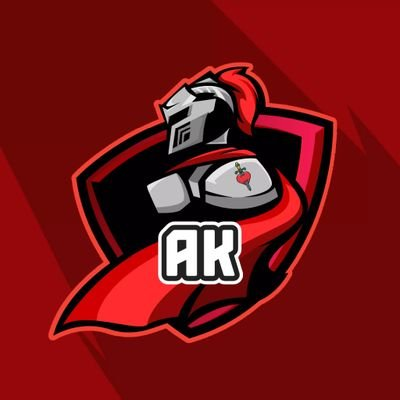

<!DOCTYPE html>
<html lang="ja">
<head>
<meta charset="UTF-8">
<meta name="viewport" content="width=device-width, initial-scale=1.0">

<title>AK黙示録騎士 | OFFICIAL</title>

<meta
    name="description"
    content="AK黙示録騎士 - FLASH PARTY CLAN OFFICIAL SITE"
/>

<link rel="preconnect" href="https://fonts.googleapis.com">
<link rel="preconnect" href="https://fonts.gstatic.com" crossorigin>

</head>

<body>

<!-- ==================================================
     HERO
================================================== -->

<header class="hero">

    <!-- 巨大背景ロゴ -->

    

    

        <!-- メインロゴ -->

        

        <h1>
            AK黙示録騎士
        </h1>

        

            FLASH PARTY CLAN
        

        

            CLAN EST. 2026
        

        

            <a
                href="#members"
                class="btn btn-red"
            >
                MEMBERS
            </a>

            <a
                href="#results"
                class="btn"
            >
                MATCH RESULTS
            </a>

        

    

    

        SCROLL
    

</header>

<!-- ==================================================
     ABOUT
================================================== -->

<section class="about">

    

        

            
                WHO WE ARE
            

            <h2>
                ABOUT US
            </h2>

        

        

            

                AK黙示録騎士は、 
                FLASH PARTYを中心に活動するゲームクラン。  

                仲間と共に戦い、 
                勝利を目指す。
            

        

    

</section>

<!-- ==================================================
     STATS
================================================== -->

<section class="stats">

    

        

            

                
                    2
                

                
                    MATCHES
                

            

            

                
                    2
                

                
                    WINS
                

            

            

                
                    100%
                

                
                    WIN RATE
                

            

        

    

</section>

<!-- ==================================================
     MEMBERS
================================================== -->

<section
    class="members"
    id="members"
>

    

        

            
                OUR PLAYERS
            

            <h2>
                MEMBERS
            </h2>

        

        

            <!-- MEMBER 01 -->

            

                

                

                

                    
                        PLAYER 01
                    

                    
                        ミミズク
                    

                    
                        FLASH PARTY PLAYER
                    

                

            

            <!-- MEMBER 02 -->

            

                

                

                

                    
                        PLAYER 02
                    

                    
                        はゆ
                    

                    
                        FLASH PARTY PLAYER
                    

                

            

            <!-- MEMBER 03 -->

            

                

                

                

                    
                        PLAYER 03
                    

                    
                        ステック
                    

                    
                        FLASH PARTY PLAYER
                    

                

            

            <!-- MEMBER 04 -->

            

                

                

                

                    
                        PLAYER 04
                    

                    
                        Oct.
                    

                    
                        FLASH PARTY PLAYER
                    

                

            

            <!-- MEMBER 05 -->

            

                

                

                

                    
                        PLAYER 05
                    

                    
                        あるちぬ
                    

                    
                        FLASH PARTY PLAYER
                    

                

            

            <!-- MEMBER 06 -->

            

                

                

                

                    
                        PLAYER 06
                    

                    
                        Puppy
                    

                    
                        FLASH PARTY PLAYER
                    

                

            

            <!-- MEMBER 07 -->

            

                

                

                

                    
                        PLAYER 07
                    

                    
                        もなか
                    

                    
                        FLASH PARTY PLAYER
                    

                

            

        

    

</section>

<!-- ==================================================
     MATCH RESULTS
================================================== -->

<section
    class="results"
    id="results"
>

    

        

            
                CLAN BATTLE RECORD
            

            <h2>
                MATCH RESULTS
            </h2>

        

        <!-- MATCH 01 -->

        

            

                2026.08.22
            

            

                

                    

                        AK黙示録騎士
                    

                    
                        AK
                    

                

                

                    VS
                

                

                    

                        でかすぎ CLAN
                    

                    
                        OPPONENT
                    

                

            

            

                
                    WIN
                

                
                    10 - 0
                

            

        

        <!-- MATCH 02 -->

        

            

                2026.07.26
            

            

                

                    

                        AK黙示録騎士
                    

                    
                        AK
                    

                

                

                    VS
                

                

                    

                        OTL CLAN
                    

                    
                        OPPONENT
                    

                

            

            

                
                    WIN
                

                
                    3 - 0
                

            

        

    

</section>

<!-- ==================================================
     NEWS
================================================== -->

<section
    class="news"
    id="news"
>

    

        

            
                LATEST INFORMATION
            

            <h2>
                NEWS
            </h2>

        

        

            

                

                    2026.08.26
                

                

                

                    AK黙示録騎士 OFFICIAL SITE OPEN
                

            

            

                

                    2026.08.26
                

                

                

                    CLAN MEMBER RECRUITMENT
                

            

        

    

</section>

<!-- ==================================================
     OFFICIAL SOCIALS
================================================== -->

<section class="join">

    

        

            
                OFFICIAL SOCIALS
            

            <h2>
                JOIN AK
            </h2>

        

        

            AK黙示録騎士の最新情報をチェック。
        

        

            <!-- =========================
                 X
            ========================== -->

            <a
                href="https://x.com/AKclan_FP"
                target="_blank"
                rel="noopener noreferrer"
                class="social-btn x-btn"
            >

                

                    <svg
                        viewBox="0 0 24 24"
                        aria-hidden="true"
                    >

                        <path
                            d="M18.244 2.25h3.308l-7.227 8.26
                            8.502 11.24h-6.657l-5.214-6.817
                            -5.963 6.817H1.684l7.73-8.835
                            L1.254 2.25H8.08l4.713 6.231
                            5.45-6.231Zm-1.161 17.52h1.833
                            L7.084 4.126H5.117L17.083 19.77Z"
                            fill="currentColor"
                        />

                    </svg>

                

                

                    <small>
                        FOLLOW US
                    </small>

                    <strong>
                        X / TWITTER
                    </strong>

                

                
                    ↗
                

            </a>

            <!-- =========================
                 TIKTOK
            ========================== -->

            <a
                href="https://www.tiktok.com/@ak16735?_r=1&_t=ZS-99CvVNqpGBY"
                target="_blank"
                rel="noopener noreferrer"
                class="social-btn tiktok-btn"
            >

                

                    <svg
                        viewBox="0 0 24 24"
                        aria-hidden="true"
                    >

                        <path
                            d="M19.59 6.69a4.83 4.83 0 0 1-3.77-4.24V2h-3.45
                            v13.67a2.92 2.92 0 1 1-2.92-2.92c.31 0 .61.05.89.14
                            v-3.52a6.35 6.35 0 1 0 5.48 6.3V8.36
                            a8.25 8.25 0 0 0 4.83 1.56V6.69h-1.06Z"
                            fill="currentColor"
                        />

                    </svg>

                

                

                    <small>
                        FOLLOW US
                    </small>

                    <strong>
                        TIKTOK
                    </strong>

                

                
                    ↗
                

            </a>

        

    

</section>

<!-- ==================================================
     FOOTER
================================================== -->

<footer>

    © 2026 AK MOKUSHIROKU KISHI

</footer>

<!-- ==================================================
     JAVASCRIPT
================================================== -->

</body>
</html>
